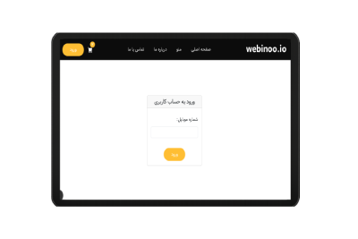
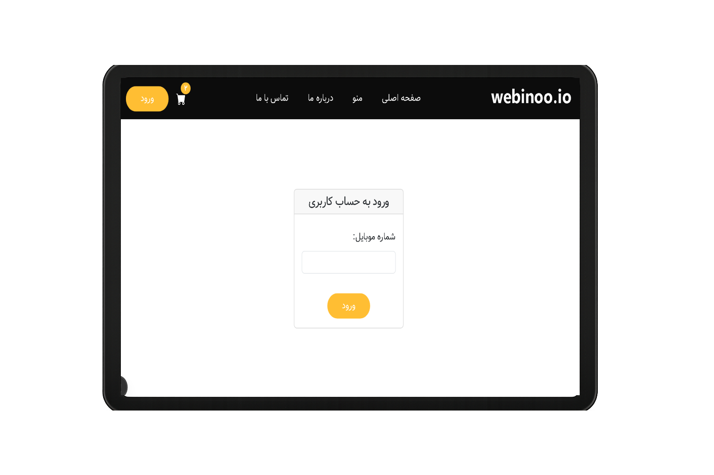
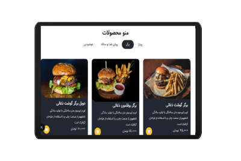
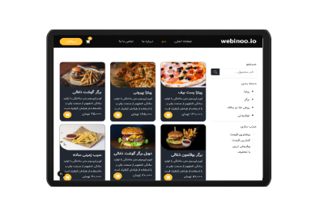
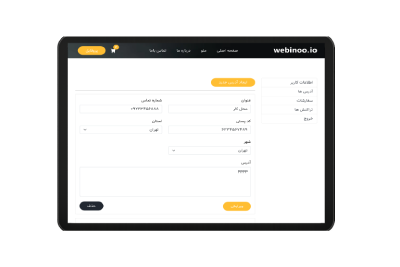
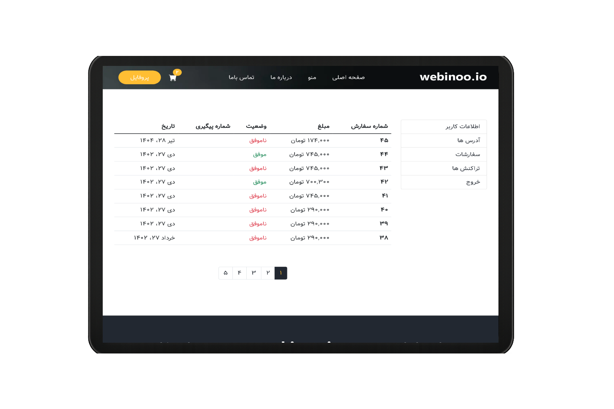
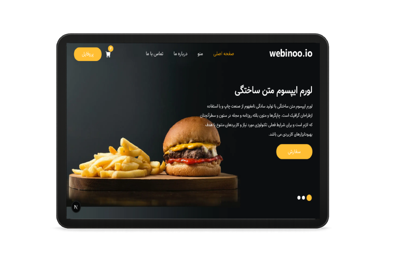
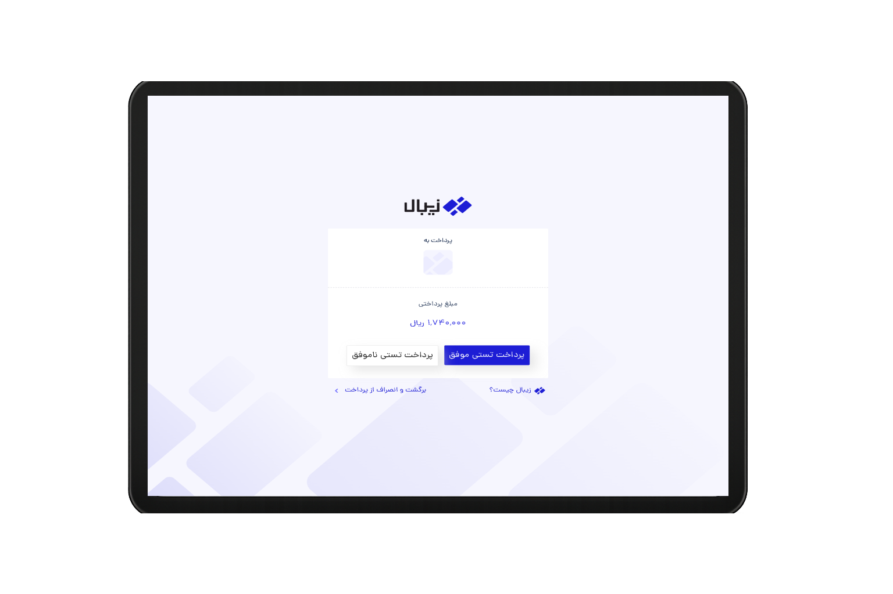
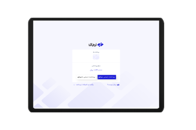

##  ساخت پروژه فروشگاهی و رستوران غذا با Nextjs و Bootstrap

- `این بخش مربوط به فرانت پروژه است
`

---

##  ویژگی های این پروژه

-> طراحی کامل با Next.js و ساختار کامپوننتی

-> استفاده از CSS و Bootstrap برای استایل‌دهی و چیدمان 

-> طراحی کاملاً Responsive برای نمایش در موبایل، تبلت و دسکتاپ

-> استفاده از Local Storage برای حفظ سبد خرید در مرورگر

-> ارتباط با API جهت دریافت  اطلاعات و دسته‌بندی‌ها و ... 

-> هندل کردن خطاهای شبکه و نمایش مناسب به کاربر

-> بهینه‌سازی عملکرد با Lazy Loading و Split Code

-> قابلیت لاگین شدن براساس شماره موبایل و ارسال کد تایید به روش Otp

-> امکان ذخیره اطلاعات ورود و هدایت کاربران به داشبورد پس از ورود موفق

-> نمایش پیام خوش‌آمدگویی    پس از ورود 

-> امکان ویرایش اطلاعات کاربری

-> نمایش پیام‌های خطا برای فیلدهای خالی یا اطلاعات نادرست

-> نمایش لیست سفارشات و تراکنش ها

-> نمایش دسته‌بندی غذاها در قالب تب‌بندی 
-> فیلتر جستجو براساس نام ,دسته بندی و مرتب سازی براساس بیشترین قیمت , کمترین  , پرفروش ترین ها و ...

-> قابلیت افزودن به سبد خرید و نمایش مجموع قیمت‌ها 

-> امکان افزودن کد تخفیف و اعمال کد تخفیف در سبد خرید

 -> قابلیت وصل شدن به درگاه پرداخت 

-> قابلیت Pagination یا صفحه بندی

-> نمایش پیشرفت جستجو در بالای  هر صفحه(Progressbar)

-> شناسایی مکان کاربر با Map

-> استفاده از React Router برای مدیریت مسیرها (صفحه اصلی، دسته‌ بندی ها، سبد خرید، 404 و ...)

---

## تکنولوژی های استفاده شده در پروژه عبارتند از :

<ul>
<li>Next.js</li>
<li>Bootstrap</li>
<li>Node.js</li>
<li>React Hooks</li>
<li>React Router</li>
<li>Redux</li>
<li>Fetch Api</li>
<li>Css</li>
</ul>

---

## کتابخانه های استفاده شده
- @reduxjs/toolkit
- bootstrap
- bootstrap-icons
- leaflet
- next
- next-nprogress-bar
- react
- react-dom
- react-redux
- react-tabs
- react-toastify
- redux-persist

## دمو و پیش نمایش پروژه
#### برای دیدن دمو [اینجا](https://next-shoping-project.vercel.app/) را کلیک کنید

---

  
  
  
  
  
  
  
  
  
  
  

---

## 📢 راه‌های ارتباطی با من

- 📞 شماره تماس: 09114759731
-  ایمیل: zozo.tiktak@gmail.com
-  واتساپ:  [ارسال پیام](https://wa.me/989114759731)
-  تلگرام: [ارسال پیام](https://t.me/ZohreZamany)

